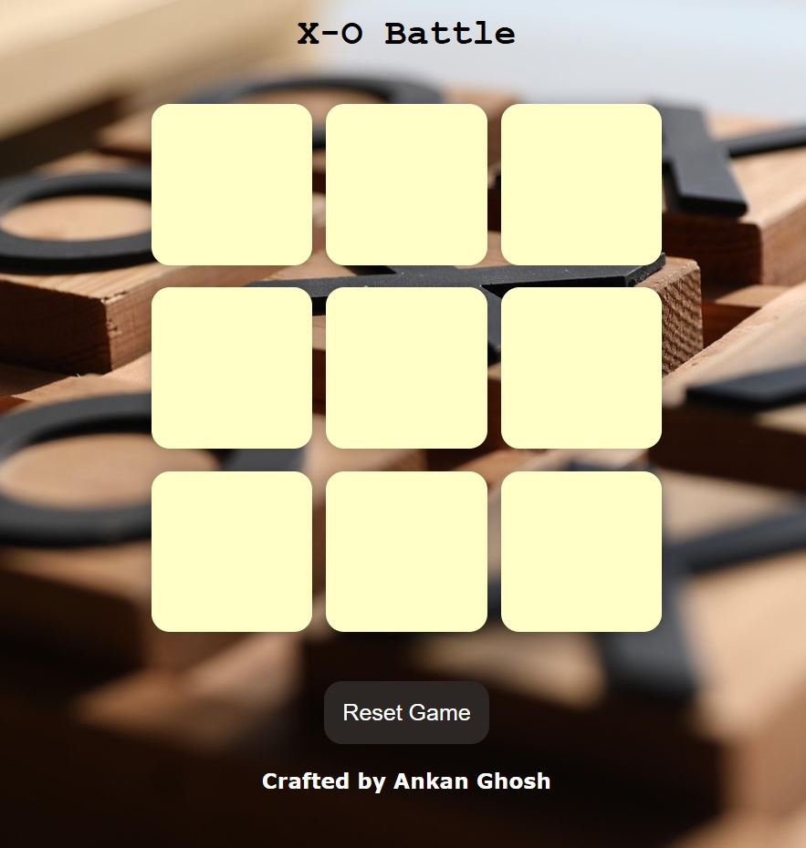

# Tic-Tac-Toe Game using JavaScript
This is a simple and interactive Tic Tac Toe game built using HTML, CSS, and JavaScript. Players take turns to mark X and O on the grid, with automatic win detection and the option to reset or start a new game.

## What We’re Going to Create
- Players take turns marking X and O on a 3×3 grid, with real-time interaction.
- The game checks for a winner or a draw, displaying messages accordingly.
- The layout adapts to different screen sizes, with a reset button to start a new game.

## Project Preview
&nbsp;

- Live Link : [Click Here !](https://ankanghosh56.github.io/X-O_Battle/)

## License
This project is licensed under the MIT License - see the [LICENSE](LICENSE) file for details.

## Feedback
We welcome feedback and contributions. Feel free to open an issue or submit a pull request.

<h1 align="center">Show some ❤ by starring this repositories!🌠</h1> 

